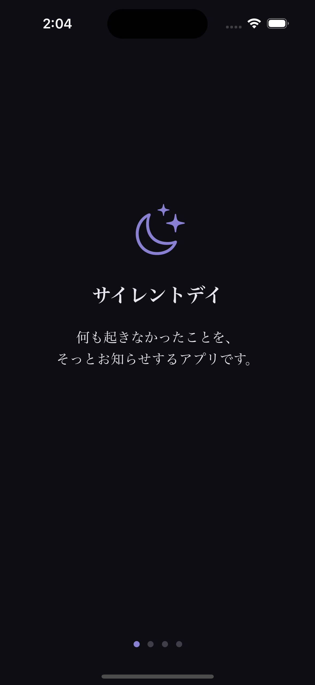
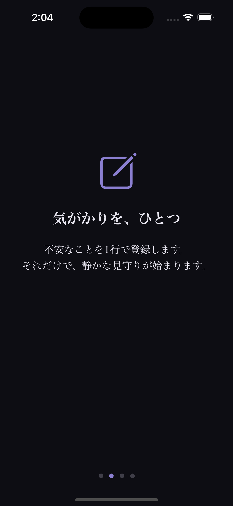
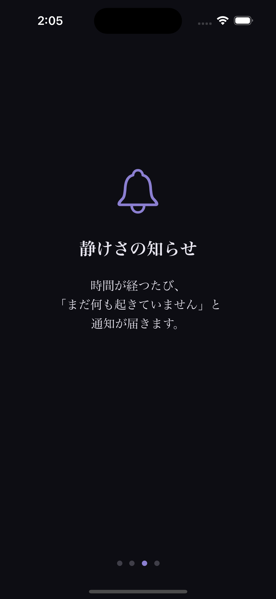
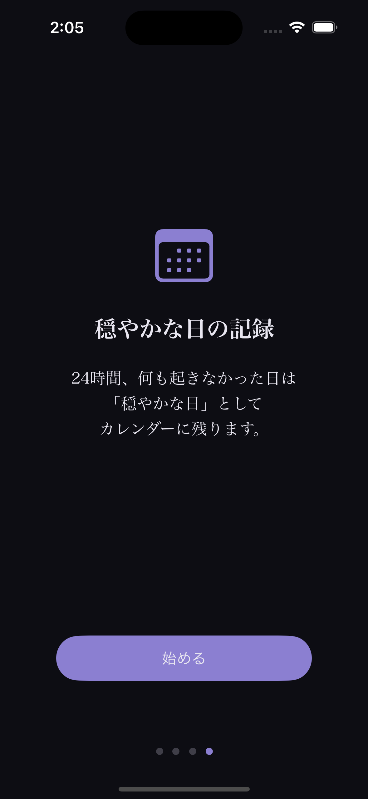
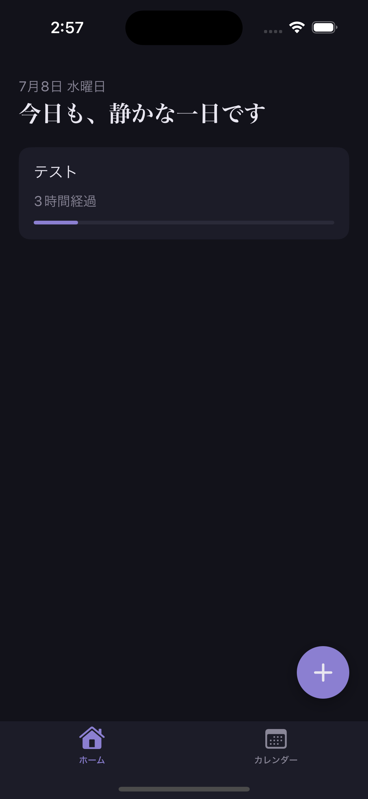
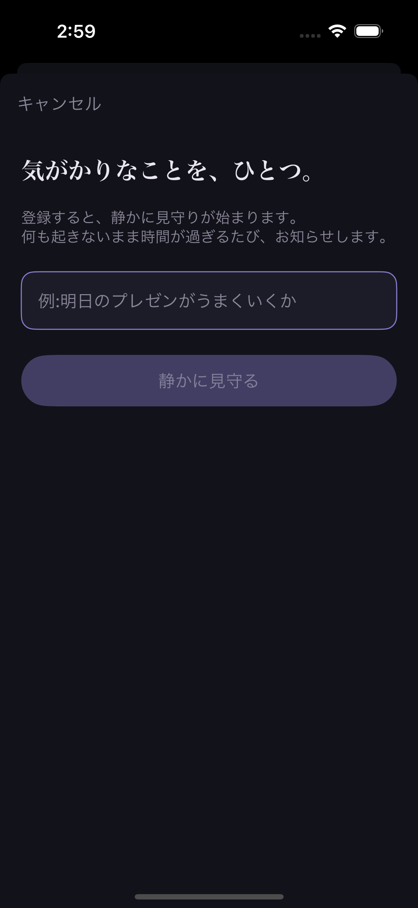
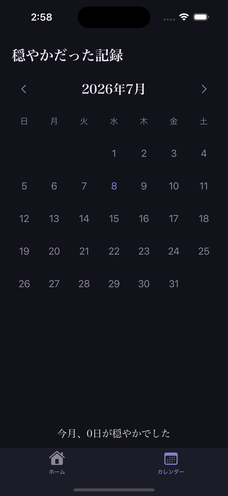

# サイレントデイ (SilentDay)

「何も悪いことが起きていない」ことを積極的に通知する、逆説型の安心アプリ。

## コンセプト

日々のちょっとした気がかり——明日のプレゼン、健康診断の結果、送ったメールの返事——を
1行で登録すると、時間が経つごとに「まだ何も起きていません」という通知が段階的に届きます。
24時間何事もなく経過すると「穏やかな一日でした」という締めのメッセージとともに、
その日はカレンダーに"穏やかな日"として記録されます。

SNSの通知や監視サービスのように「何かが起きたこと」を知らせるアプリはたくさんありますが、
このアプリは逆に**「何も起きていないこと」を知らせる**ことで安心を提供します。
外部APIには一切依存せず、通信を行わない完全ローカル完結型のアプリです(プライバシー・費用ゼロ)。

ポートフォリオ・個人利用目的のアプリで、App Storeでの公開は想定していません。

## 技術スタック

| 分類 | 使用技術 |
|---|---|
| 言語 / UI | Swift / SwiftUI |
| 永続化 | SwiftData(iOS 17〜) |
| 通知 | UserNotifications(ローカル通知のみ、リモート通知なし) |
| 状態管理 | Observation フレームワーク(`@Observable`) |
| 対象OS | iOS 17.2〜 |
| 開発環境 | Xcode 15.2 |
| 外部API | なし(完全オフライン動作) |

## アーキテクチャ: MVVM + Repository

```
View ──観察──> ViewModel ──呼び出し──> Repository ──アクセス──> SwiftData (ModelContext)
```

- **View**: 画面の見た目のみを担当。ロジックやデータアクセスは持たない
- **ViewModel**: `@Observable` を付けたクラス。画面用の状態管理・入力チェック・
  Repository/Serviceの呼び出しを担当する
- **Repository**: `WorryRepository` / `LogRepository` がSwiftDataとのやり取り(CRUD)を
  1箇所に集約する。ViewModelはSwiftDataの詳細を知らずに済む
- **Service**: 画面に依存しない独立ロジックを切り出す層
  - `MessageGenerator`: 通知文言のランダム生成
  - `NotificationService`: ローカル通知のスケジュール・キャンセル・受信ハンドリング
  - `WorryCompletionService`: 24時間経過した不安の完了処理と穏やかな日ログへの記録
- **DesignSystem**: `Colors.swift` / `Typography.swift` / `Animations.swift` に
  色・フォント・アニメーションを定数化し、View側では直接値を書かない運用にしている

各層を分離することで、「保存方法を変えたい」「文言生成ロジックだけ単体テストしたい」
といった変更・検証がしやすい構成になっています。

## 画面構成

| ID | 画面 | 役割 |
|---|---|---|
| S-01 | ホーム画面 | 登録中の不安リストと24時間の経過進捗を表示 |
| S-02 | 追加画面 | 新しい不安を1行テキストで登録(sheet表示) |
| S-03 | 通知詳細画面 | 通知タップ時に文言をフェードインで表示(全画面) |
| S-04 | カレンダー画面 | 穏やかだった日を月表示カレンダーで振り返る |
| S-05 | 日別詳細画面 | 特定の日に完了した不安の一覧 |
| S-06 | オンボーディング | 初回起動時のみ、4ページのスワイプで世界観を説明 |

画面遷移: オンボーディング(初回のみ)→ ホーム/カレンダーのタブ切替、
ホームから追加画面へsheet遷移、カレンダーから日別詳細へpush遷移、
通知タップで通知詳細画面へfullScreenCover遷移。

## スクリーンショット

### オンボーディング(S-06)

| 1ページ目 | 2ページ目 | 3ページ目 | 4ページ目 |
|---|---|---|---|
|  |  |  |  |

### メイン画面

| ホーム画面(S-01) | 追加画面(S-02) | カレンダー画面(S-04) |
|---|---|---|
|  |  |  |

> 通知詳細画面(S-03)と日別詳細画面(S-05)のスクリーンショットは今回未収録です。次バージョン(v1.1)で追加予定です。

## 工夫した点

### 1. 通知の演出設計
ローカル通知は1項目につき登録から6h/12h/24h後の3段階で予約し(`NotificationService`)、
`MessageGenerator`が経過時間帯(0-6h/6-24h/24h以降)ごとに用意したテンプレートから
`randomElement()`でランダムに文言を選ぶ。同じ状況でも毎回違う言い回しになることで、
通知が機械的に感じられないようにしている。通知タップ時は`NotificationCenter`経由で
アプリ内にイベントを放送し、`ContentView`がそれを受けて通知詳細画面(S-03)を
`fullScreenCover`で表示。表示は0.5秒待ってから1秒かけてフェードインする演出にし、
静かに寄り添うトーンを画面遷移そのもので表現している。

### 2. 通知64件制約への対応
iOSのローカル通知は端末あたり最大64件までという制約がある。
1項目=3通知のため、UI側で同時登録数を最大10件に制限し、
最大でも30件の保留通知に収まるよう設計して余裕を持たせている。

### 3. デザインシステムの一元化
色は`Colors.swift`、フォントは`Typography.swift`、アニメーションは`Animations.swift`に
定数として集約し、各Viewはそれらの定数のみを参照する運用にしている。
仕様書のデザイン確定値(ダークネイビー基調のカラーパレット、明朝体+システムフォントの
使い分け、0.5〜1秒のフェードイン等)を変更する際、この3ファイルを直せば
全画面に反映される。

### 4. #Predicateマクロの不具合回避
開発環境(Xcode 15.2 / iOS 17.2)において、SwiftDataの`#Predicate`マクロを使った
フェッチ(Bool比較を含む条件)で画面が真っ白になる不具合を実機検証で確認した
(`WorryRepository.fetchActive()`にて発生)。
これを受け、全Repositoryクラスで`FetchDescriptor`は条件なし(ソートのみ)の
全件取得のみを行い、絞り込みはSwift側の`filter` / `first(where:)`で行う方式に統一した。
個人利用規模のデータ量であれば性能上の懸念もないため、開発規約として`CLAUDE.md`にも
明記し、以降実装するRepositoryすべてに一貫して適用している。

### 5. アプリを開いたタイミングでの完了判定
このアプリは通信もバックグラウンド処理も行わない(NF-01)ため、
「24時間経過した瞬間」にコードを自動実行することはできない。
そこで`WorryCompletionService`がホーム画面表示のたびに「24時間を超えた不安」を
まとめてチェックし、完了フラグの更新と穏やかな日ログへの記録を行う方式にした。
24時間後のローカル通知自体はアプリを開かなくても届くため、体験上の問題は生じない。

## 今後の展望

- iCloud同期による複数端末対応(現状はスコープ外)
- 通知権限が拒否された場合のアプリ内フォールバック表示の強化(NF-04)
- VoiceOver対応の拡充(現状は主要な操作にのみラベル・ヒントを付与)
- SwiftDataの`VersionedSchema`を用いたマイグレーション対応(フィールド追加時)
- 穏やかな日ログの週間・月間振り返り機能(グラフ表示等)
